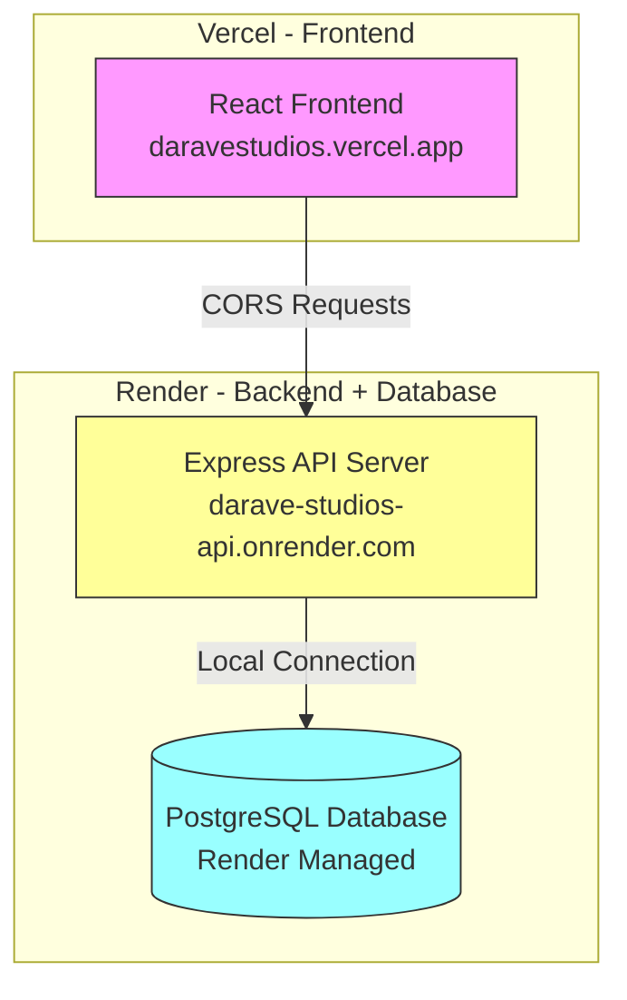
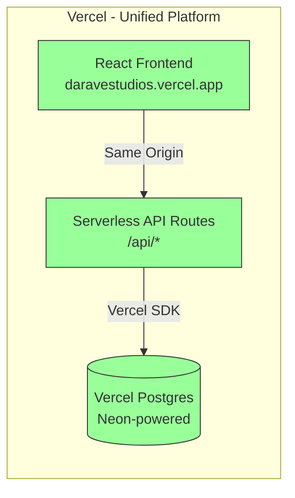
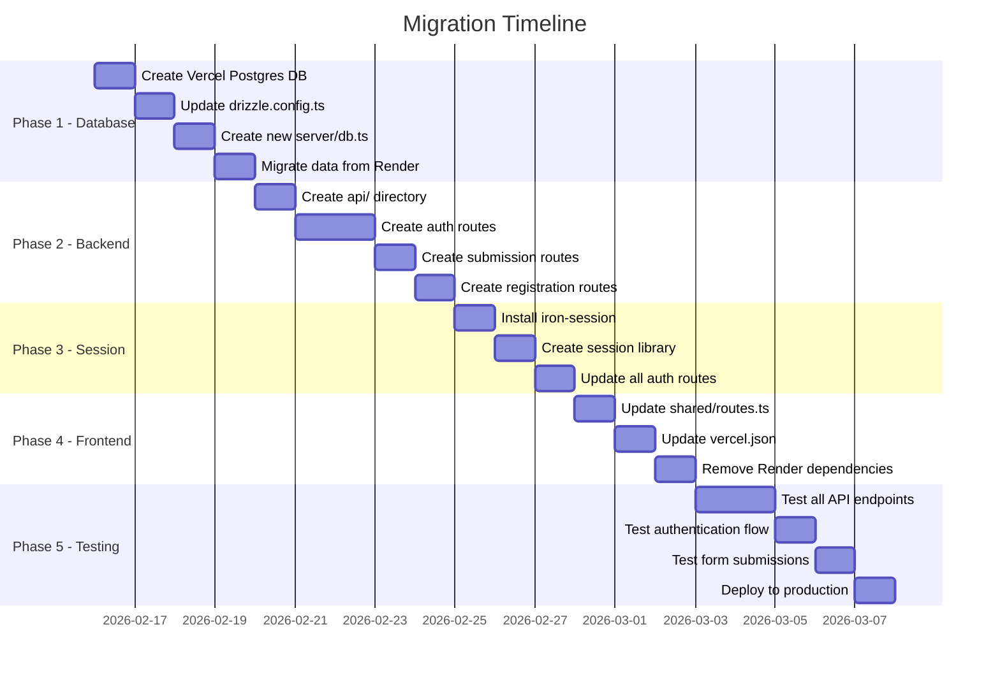

# Migration Plan: Render → Vercel Ecosystem

## Executive Summary

This document outlines the complete migration strategy for moving the Darave Studios fullstack application from Render-hosted infrastructure to a unified Vercel ecosystem, eliminating CORS issues and cross-domain communication problems.

---

## 1. Current Architecture Analysis

### 1.1 Infrastructure Overview



### 1.2 Current Technology Stack

| Component | Technology | Location |
|-----------|------------|----------|
| Frontend | React + Vite + TanStack Query | Vercel |
| Backend | Express.js + Node.js | Render |
| Database | PostgreSQL | Render |
| ORM | Drizzle ORM | Both |
| Session | express-session + connect-pg-simple | Render |
| Authentication | bcrypt + session cookies | Render |

### 1.3 Current Problems Identified

1. **CORS Complexity**
   - Frontend on `daravestudios.vercel.app` calls API on `darave-studios-api.onrender.com`
   - Requires complex CORS configuration in [`server/routes.ts`](server/routes.ts:44)
   - Session cookies need `sameSite: "none"` and `partitioned: true` for cross-origin

2. **Third-Party Cookie Blocking**
   - Modern browsers increasingly block third-party cookies
   - Chrome 127+ requires CHIPS (partitioned cookies)
   - Safari/Firefox have stricter policies

3. **Cold Start Issues**
   - Render free tier spins down after inactivity
   - First request takes 30+ seconds to respond
   - Session cookies may be lost during cold starts

4. **Session Management Complexity**
   - PostgreSQL session store requires persistent connection
   - Session persistence across serverless functions is problematic
   - Complex configuration in [`server/routes.ts`](server/routes.ts:103-127)

### 1.4 Database Schema

Current tables in PostgreSQL:
- `users` - User accounts with bcrypt passwords
- `registrations` - Email registrations for interest lists
- `session` - Express session storage
- `game_submissions` - Game submission forms
- `asset_submissions` - Asset submission forms

---

## 2. Target Architecture - Vercel Native

### 2.1 Proposed Architecture



### 2.2 Key Benefits

| Problem | Current | Solution |
|---------|---------|----------|
| CORS Issues | Cross-origin requests | Same-origin (unified domain) |
| Cookie Blocking | Third-party cookies | First-party cookies |
| Cold Starts | Render spin-down | Vercel Edge Functions |
| Session Management | PostgreSQL sessions | JWT + HTTP-only cookies |
| Connection Pooling | Manual pool config | Vercel Postgres auto-pooling |

### 2.3 Technology Changes

| Component | Current | Target |
|-----------|---------|--------|
| Backend Runtime | Express.js server | Vercel Serverless Functions |
| Database | Render PostgreSQL | Vercel Postgres |
| Database Driver | pg + drizzle-orm/node-postgres | @vercel/postgres + drizzle-orm |
| Session Management | express-session + PG store | JWT with iron-session |
| API Structure | Express routes | Next.js-like API routes |

---

## 3. Migration Strategy

### 3.1 Phase 1: Database Migration

#### 3.1.1 Create Vercel Postgres Database

1. Go to Vercel Dashboard → Storage → Create Database
2. Select "Postgres" (Neon-powered, integrated with Vercel)
3. Link to your project (daravestudios)
4. Environment variables auto-injected:
   - `POSTGRES_URL`
   - `POSTGRES_PRISMA_URL`
   - `POSTGRES_URL_NON_POOLING`
   - `POSTGRES_USER`
   - `POSTGRES_HOST`
   - `POSTGRES_PASSWORD`
   - `POSTGRES_DATABASE`

#### 3.1.2 Update Database Configuration

**File: [`drizzle.config.ts`](drizzle.config.ts)**

```typescript
import { defineConfig } from "drizzle-kit";

export default defineConfig({
  out: "./drizzle",
  schema: "./shared/schema.ts",
  dialect: "postgresql",
  dbCredentials: {
    url: process.env.POSTGRES_URL || process.env.DATABASE_URL,
  },
});
```

**File: [`server/db.ts`](server/db.ts)** - Needs complete rewrite for Vercel Postgres

```typescript
import { drizzle } from "drizzle-orm/vercel-postgres";
import { sql } from "@vercel/postgres";
import * as schema from "@shared/schema";

export const db = drizzle(sql, { schema });
```

#### 3.1.3 Data Migration Steps

1. Export data from Render PostgreSQL:
   ```bash
   pg_dump $RENDER_DATABASE_URL > backup.sql
   ```

2. Import to Vercel Postgres:
   ```bash
   psql $POSTGRES_URL < backup.sql
   ```

3. Or use Drizzle migrations:
   ```bash
   npm run db:push
   ```

### 3.2 Phase 2: Backend Migration to Serverless

#### 3.2.1 New API Route Structure

```
api/
├── auth/
│   ├── register.ts
│   ├── login.ts
│   ├── logout.ts
│   └── me.ts
├── registrations/
│   └── index.ts
├── submissions/
│   ├── game.ts
│   └── asset.ts
└── health.ts
```

#### 3.2.2 Example API Route Conversion

**Current: Express Route in [`server/routes.ts`](server/routes.ts:156-228)**

```typescript
// Current Express route
app.post("/api/auth/register", authLimiter, async (req: Request, res: Response) => {
  // ... handler code
});
```

**Target: Vercel Serverless Function**

```typescript
// api/auth/register.ts
import { VercelRequest, VercelResponse } from '@vercel/node';
import { db } from '../../lib/db';
import { users } from '@shared/schema';
import { eq } from 'drizzle-orm';
import bcrypt from 'bcryptjs';
import { setSession } from '../../lib/session';

export default async function handler(req: VercelRequest, res: VercelResponse) {
  if (req.method !== 'POST') {
    return res.status(405).json({ message: 'Method not allowed' });
  }

  try {
    const { email, password, name } = req.body;
    
    // Validation and user creation logic
    const existingUser = await db.select().from(users).where(eq(users.email, email));
    
    if (existingUser[0]) {
      return res.status(400).json({ message: 'User already exists' });
    }

    const hashedPassword = await bcrypt.hash(password, 10);
    const [user] = await db.insert(users).values({
      email,
      password: hashedPassword,
      name,
    }).returning();

    // Set JWT session
    await setSession(res, { userId: user.id });

    return res.status(201).json({
      user: { id: user.id, email: user.email, name: user.name }
    });
  } catch (error) {
    return res.status(500).json({ message: 'Internal server error' });
  }
}
```

### 3.3 Phase 3: Session Management Migration

#### 3.3.1 Current Session Issues

The current implementation in [`server/routes.ts`](server/routes.ts:103-127) uses:
- `express-session` with PostgreSQL store
- Cross-origin cookies with `sameSite: "none"`
- `partitioned: true` for CHIPS support

#### 3.3.2 Recommended Solution: iron-session

**Why iron-session?**
- Password-based cookie encryption
- Works perfectly with serverless functions
- No database session storage needed
- First-party cookies (same domain)

**Installation:**
```bash
npm install iron-session
```

**Session Library:**

```typescript
// lib/session.ts
import { getIronSession } from 'iron-session';
import { VercelRequest, VercelResponse } from '@vercel/node';

interface SessionData {
  userId?: number;
}

const sessionOptions = {
  password: process.env.SESSION_SECRET || 'complex_password_at_least_32_characters_long',
  cookieName: 'darave_session',
  cookieOptions: {
    secure: process.env.NODE_ENV === 'production',
    httpOnly: true,
    sameSite: 'lax' as const,
    maxAge: 60 * 60 * 24 * 30, // 30 days
    path: '/',
  },
};

export async function getSession(req: VercelRequest, res: VercelResponse) {
  return getIronSession<SessionData>(req, res, sessionOptions);
}

export async function setSession(res: VercelResponse, data: SessionData) {
  // Session is set via the getSession function
}
```

### 3.4 Phase 4: Frontend Updates

#### 3.4.1 API Client Changes

**File: [`shared/routes.ts`](shared/routes.ts)**

The API base URL logic needs simplification since everything will be same-origin:

```typescript
// Simplified - all requests are same-origin now
const API_BASE_URL = '';

export const api = {
  auth: {
    register: {
      method: 'POST' as const,
      path: '/api/auth/register' as const,
      // ...
    },
    login: {
      method: 'POST' as const,
      path: '/api/auth/login' as const,
      // ...
    },
    // ...
  },
};
```

#### 3.4.2 Vercel Configuration Update

**File: [`vercel.json`](vercel.json)**

```json
{
  "rewrites": [
    {
      "source": "/api/:path*",
      "destination": "/api/:path*"
    },
    {
      "source": "/((?!api/).*)",
      "destination": "/index.html"
    }
  ],
  "functions": {
    "api/**/*.ts": {
      "runtime": "@vercel/node@3"
    }
  }
}
```

---

## 4. Implementation Roadmap

### 4.1 Detailed Task List



### 4.2 File Changes Summary

| File | Action | Description |
|------|--------|-------------|
| [`server/db.ts`](server/db.ts) | Rewrite | Use @vercel/postgres instead of pg |
| [`drizzle.config.ts`](drizzle.config.ts) | Modify | Use POSTGRES_URL env var |
| [`server/index.ts`](server/index.ts) | Delete | No longer needed for serverless |
| [`server/routes.ts`](server/routes.ts) | Delete | Split into API routes |
| [`server/static.ts`](server/static.ts) | Delete | Vercel handles static files |
| [`server/vite.ts`](server/vite.ts) | Delete | Vercel handles builds |
| [`shared/routes.ts`](shared/routes.ts) | Simplify | Remove API_BASE_URL logic |
| [`vercel.json`](vercel.json) | Update | Add API function config |
| [`package.json`](package.json) | Update | Add/remove dependencies |
| `api/**/*.ts` | Create | New serverless API routes |
| `lib/session.ts` | Create | iron-session configuration |
| `lib/db.ts` | Create | Vercel Postgres connection |

### 4.3 Dependencies Changes

**Add:**
```json
{
  "@vercel/postgres": "^0.5.0",
  "iron-session": "^8.0.0"
}
```

**Remove:**
```json
{
  "pg": "no longer needed",
  "connect-pg-simple": "no longer needed",
  "express-session": "no longer needed",
  "cors": "no longer needed - same origin"
}
```

---

## 5. Risk Assessment

### 5.1 Potential Issues

| Risk | Impact | Mitigation |
|------|--------|------------|
| Data loss during migration | High | Full backup before migration, test on staging first |
| Session invalidation | Medium | Users will need to re-login after migration |
| API behavior differences | Medium | Comprehensive testing of all endpoints |
| Cold start latency | Low | Vercel functions have minimal cold starts |
| Connection limits | Low | Vercel Postgres handles pooling automatically |

### 5.2 Rollback Plan

1. Keep Render database running during migration
2. Keep Render API server available as fallback
3. Use environment variable to switch between backends if needed
4. DNS can be quickly pointed back to Render if critical issues

---

## 6. Cost Comparison

### 6.1 Current Costs (Render)

| Service | Plan | Cost |
|---------|------|------|
| Web Service | Free | $0/month |
| PostgreSQL | Free | $0/month |
| **Total** | | **$0/month** |

### 6.2 Target Costs (Vercel)

| Service | Plan | Cost |
|---------|------|------|
| Pro Plan (optional) | Pro | $20/month |
| Postgres | Included | $0/month (limited) |
| Serverless Functions | Included | $0/month (limited) |
| **Total** | | **$0-20/month** |

**Note:** Vercel Postgres free tier includes:
- 512 MB storage
- 100 GB data transfer
- Suitable for small-medium applications

---

## 7. Next Steps

1. **Review this plan** and confirm the approach
2. **Create Vercel Postgres database** in Vercel dashboard
3. **Begin Phase 1** (Database migration)
4. **Proceed through phases** sequentially
5. **Test thoroughly** before production deployment

---

## 8. Confirmed Requirements

Based on user feedback:

| Requirement | Status |
|-------------|--------|
| Supabase Usage | ❌ Not used - legacy variables, can be removed |
| Database Size | Small (< 100 records) - quick migration |
| Downtime Tolerance | ✅ Acceptable - simplifies migration |
| Vercel Plan | Free Hobby plan |
| Session Handling | Users will need to re-login after migration |

### 8.1 Hobby Plan Considerations

Vercel Postgres on Hobby plan includes:
- 512 MB storage (sufficient for small database)
- 100 GB data transfer per month
- Automatic connection pooling
- Integrated with Vercel deployments

### 8.2 Cleanup Tasks

Remove unused Supabase environment variables from:
- [`.env`](.env) - Remove `VITE_SUPABASE_URL`, `VITE_SUPABASE_ANON_KEY`, `SUPABASE_SERVICE_ROLE_KEY`
